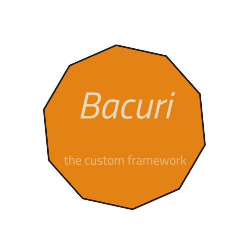

# Bacuri - The Custom Framework


## About

Bacuri is a minimalist framework that uses Material Design concepts, and has a
plugin system to enhance its capabilities.

Check the [official documentation](https://github.com/luigi-ms/bacuri-framework/wiki)
for more infos.

## Installation

Requirements:
- Node.js 
- Sass compiler

NPM
```bash
$ npm i bacuri
```

Yarn
```bash
$ yarn add bacuri
```

## Plugins

Bacuri basically adds a color scheme, some typography, buttons and set 
a flexbox layout. For more components can be addded using the plugin system.

[Read more about the plugin system](https://github.com/luigi-ms/bacuri-framework/wiki/Pulp.md)

## Semantic HTML

Since the classes are attached to a specific HTML tag, the understading of
[Semantic HTML](https://developer.mozilla.org/en-US/curriculum/core/semantic-html/)
is need for a better use.

## Built with

-   HTML5
-   SCSS
-   Typescript
-   Rollup

## Author

Luigi Moraes

-   [Github](https://github.com/luigi-ms)
